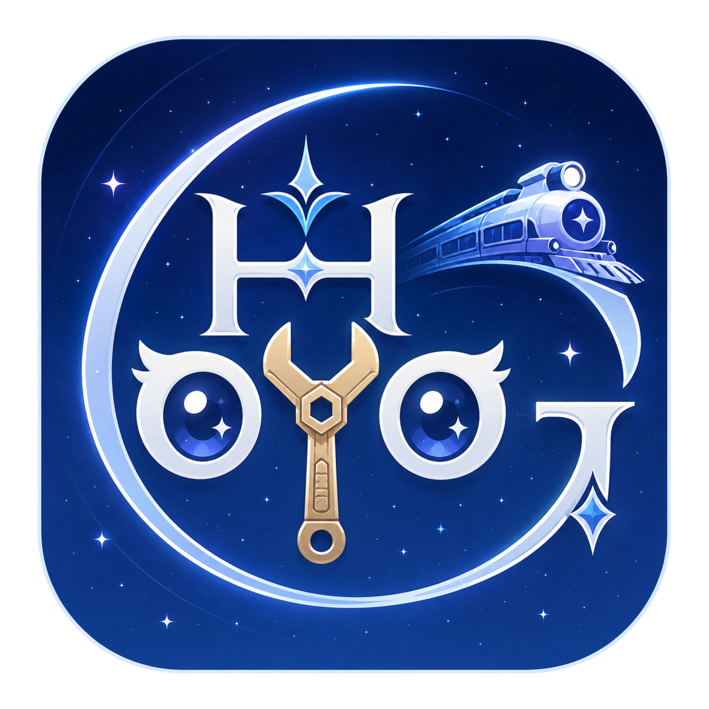

<p align="center">
  
</p>

<h1 align="center">HoyoGraphae</h1>

<p align="center"><strong>面向米哈游／HoYoverse 游戏架空文字的本地多功能工作台</strong></p>

<p align="center"><strong>简体中文</strong> · <a href="./README_en.md">English</a></p>

> [!IMPORTANT]
> 项目目前处于桌面原型阶段。字体查阅与文本生成的基础界面正在落地；火星文原生渲染和架空文字 OCR 尚未完成。README 会明确区分“已经可用”和“计划实现”，不会把普通 OCR 包装成架空文字识别。

## 一个应用，四种工作方式

| 模块 | 用途 | 当前状态 |
| --- | --- | --- |
| 字体库 | 汇集并筛选各游戏中的架空文字字体 | 11 个源已构建为 29 个内置字体实例并在启动时自动载入；按游戏目录待实现 |
| 字形查阅 | 按字符、Unicode 与字形浏览字体 | 可直接查阅当前内置字体；正反查目录待实现 |
| 文本生成 | 键盘输入、实时预览，并导出透明或纯色背景 PNG | 可直接使用当前内置字体；字体下拉与虚拟键盘待实现 |
| 图片文字识别 | 从截图中定位并转写架空文字 | 界面与引擎边界已预留；专用模型待训练 |

火星文不是普通字体，而是一套组合式矢量书写系统。项目完整保留其上游实现，后续会以 Qt `QPainter` 原生移植，而不是把网页运行时塞进桌面程序。

## 本地 Qt 方案

首版采用 **Python 3.11 + PySide6 6.9+ + Qt Widgets**：

- Qt 负责桌面界面、字体加载、屏幕渲染与图片导出；
- fontTools 读取 cmap、字形名称与字体元数据；
- `.glyphs` 文件只在构建阶段通过 glyphsLib/fontmake 转换，不在运行时修改；
- OCR 训练与桌面应用分离，未来发布包只携带版本化的 ONNX 推理模型；
- 所有字体均以进程内方式加载，不安装到 Windows 系统字体目录。

### 从源码启动（Windows PowerShell）

```powershell
git clone https://github.com/Etymodes/HoyoGraphae.git
Set-Location HoyoGraphae

py -3.11 -m venv .venv
& .\.venv\Scripts\python.exe -m pip install --upgrade pip
& .\.venv\Scripts\python.exe -m pip install -e ".[dev]"
& .\.venv\Scripts\python.exe -m hoyographae
```

当前开发分支携带由 11 个 `.glyphs` 源可重复构建的 29 个静态 TTF。应用启动时会把它们载入当前进程，无需先安装到 Windows，也无需选择外部字体。当前字体列表和“选择字体文件”按钮是过渡界面，后续会由按游戏与文字体系组织的目录替换。

## 上游资源与版本固定

HoyoGraphae 由 [@Etymodes](https://github.com/Etymodes) 维护；首批字体与书写系统资源源自 [@SpeedyOrc-C](https://github.com/SpeedyOrc-C) 与 @Etymodes 共同参与开发的两个上游项目，并按各自许可与贡献者授权固定版本。当前源快照如下：

| 来源 | 分支与提交 | 在本仓库中的位置 |
| --- | --- | --- |
| [HoYo-Glyphs](https://github.com/SpeedyOrc-C/HoYo-Glyphs) | `main@ad0c03ce9792d623c6a6161e5582a01903bd5d97` | Git 历史与 `src/*.glyphs` |
| [Honkai-3rd-II-Martian](https://github.com/SpeedyOrc-C/Honkai-3rd-II-Martian) | `main@89998b86c83e364d970be639917f422b00d6015b` | `upstream/Honkai-3rd-II-Martian/` |

两个上游目前都只有 `main` 这一条公开开发分支。精确机器可读记录见 [`upstreams.lock.json`](./upstreams.lock.json)。继承的 HoYo-Glyphs 字体是人工重建资源，**不是游戏解包文件**。

### 主线收录原则

HoyoGraphae 的长期定位，是面向米哈游／HoYoverse 开发的各款游戏，逐步整合其架空文字、人工重建字体及相关查阅与识别能力。新增资源先在开发分支中完成来源、贡献者授权、许可、技术质量与回归测试审核；只有审核通过并记录固定版本后，才合入 `main`。因此，“覆盖各款游戏”是持续建设目标，不表示当前版本已经收录所有游戏或所有文字，也不表示这些资源是官方发布或游戏解包文件。

## 路线图

- **M0 · 桌面骨架：** 字体载入、字形网格、实时打字预览、PNG 导出、OCR 占位页。
- **M1 · 内置字库：** 字体批量构建和启动时载入已完成；游戏目录、变量轴、火星文 Qt 原生渲染及金图回归测试待实现。
- **M2 · 本地 OCR：** 先支持一种文字和手动框选单行识别，冻结测试集并公开准确率，再加入自动文字检测。

## 支持开发者

<table>
  <tr>
    <td align="center">
      <strong>陈湛明 · 微信赞赏</strong><br><br>
      
    </td>
    <td align="center">
      <strong>@Etymodes · Zelle</strong><br><br>
      <code>Peterpig123456@gmail.com</code>
    </td>
  </tr>
</table>

赞赏完全自愿，不构成购买或取得字体商业授权。

## 许可与声明

- HoyoGraphae 原创 Qt/Python 应用代码采用根目录的 [MIT License](./LICENSE)，Copyright © 2026 Songyuan Wu（吴松原，Etymodes）。
- HoYo-Glyphs 字体与字母资源继续遵循其[自定义非商业许可](./LICENSES/HoYo-Glyphs-NONCOMMERCIAL.txt)：禁止商业使用，并对嵌入、修改与来源链接有明确要求。
- 火星文原实现遵循 [MIT License](./upstream/Honkai-3rd-II-Martian/LICENSE)，Copyright © 2023 陈湛明。
- HoyoGraphae 名称、标志和图标不包含在应用代码的 MIT 许可中；除非另有书面说明，其版权保留。
- 本仓库包含多种许可；根目录 MIT 不会覆盖单独标明许可的资源。详细映射见 [`LICENSES/README.md`](./LICENSES/README.md)。
- 完整来源与第三方说明见 [`THIRD_PARTY_NOTICES.md`](./THIRD_PARTY_NOTICES.md)。

HoyoGraphae 是非官方同人项目，与 HoYoverse 及其关联方没有隶属、赞助或背书关系。游戏及产品名称归各自权利人所有。
